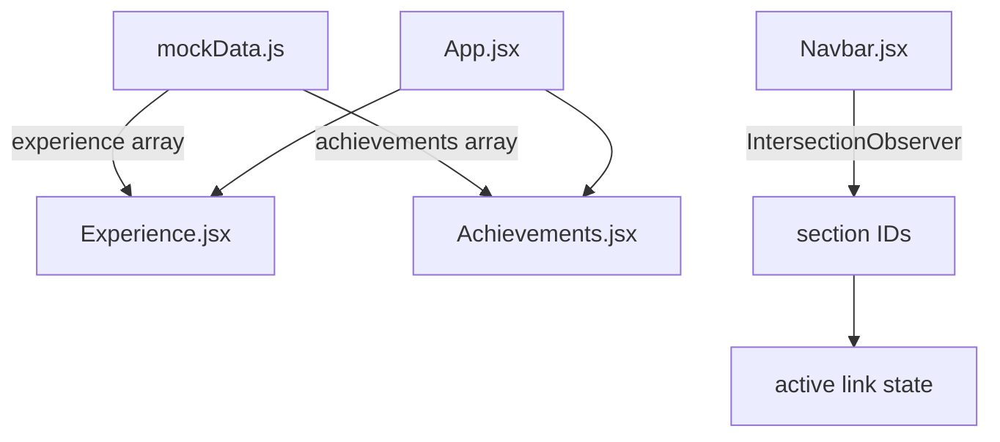

# Design Document

## Feature: portfolio-experience-achievements

---

## Overview

This feature extends the portfolio with two new sections — **Experience** and **Achievements & Certifications** — and applies a targeted set of audit fixes to clean up the existing codebase.

The Experience section renders a data-driven vertical card layout showing Varun's professional timeline. The Achievements section renders a native-CSS horizontal snap carousel without any external carousel library. Both sections are wired into the floating bottom Navbar with IntersectionObserver-based active highlighting.

The audit fixes are scoped to six files: `ThemeContext.jsx` (merge double effect), `BackToTop.jsx` (color palette), `Footer.jsx` (email), `App.css` (section-padding), `Projects.jsx` (dead state/functions), and `Hero.jsx` / `Contact.jsx` / `Navbar.jsx` (unused imports). `AboutSimple.jsx` is deleted entirely.

All new code must preserve the existing design system exactly — gray scale only, Inter font, the existing Tailwind tokens and Framer Motion variants.

---

## Architecture

The application is a single-page React + Vite SPA. Routing uses React Router with a single `"/"` route. The component tree is flat inside `<main>`:

```
App
├── ThemeProvider (context)
├── Toast
├── Navbar
├── main
│   ├── Hero          #home
│   ├── About         #about
│   ├── Experience    #experience   ← new
│   ├── Projects      #projects
│   ├── Achievements  #achievements ← new
│   └── Contact       #contact
├── Footer
└── BackToTop
```

Data flows unidirectionally: `mockData.js` → section components (no state management beyond local component state). No new context, no new hooks file is required.



---

## Components and Interfaces

### 1. `src/Data/mockData.js` — additions

Two new named exports are appended to the existing file:

```js
export const experience = [ /* ExperienceEntry[] */ ]
export const achievements = [ /* AchievementEntry[] */ ]
```

### 2. `src/components/Experience.jsx`

**Props:** none (reads `experience` from `mockData.js` directly)

**Responsibilities:**
- Render section with `id="experience"`, `section-padding`, `container-custom`
- Render the section heading
- Map over `experience` array and render one `ExperienceCard` per entry
- Handle empty/undefined gracefully (render no cards)

**Internal structure:**

```
<section id="experience" className="section-padding bg-white dark:bg-dark-custom">
  <motion.div variants={staggerContainer} ...>
    <motion.div variants={fadeIn}>  ← heading
    {experience.map(entry => (
      <motion.div variants={slideUp} key={entry.id} whileHover={...}>  ← card
        CardHeader
        CardBody
        CardFooter
    ))}
  </motion.div>
</section>
```

### 3. `src/components/Achievements.jsx`

**Props:** none (reads `achievements` from `mockData.js` directly)

**Internal state:**
- `canScrollLeft: boolean` — whether scrollLeft > 0
- `canScrollRight: boolean` — whether we haven't reached the end

**Refs:**
- `scrollRef: useRef` — attached to the carousel container `<div>`

**Responsibilities:**
- Render section with `id="achievements"`, `section-padding`, `container-custom`
- Render heading, Prev/Next buttons, and carousel container
- Wire wheel hijacking, keyboard navigation, and scroll event for button state
- Map over `achievements` array and render one card per entry

**Internal structure:**

```
<section id="achievements" className="section-padding bg-white dark:bg-dark-custom">
  <motion.div variants={staggerContainer} ...>
    <motion.div variants={fadeIn}>  ← heading + controls row
      <h2>...</h2>
      <div>  ← Prev / Next buttons
    <motion.div variants={fadeIn}>  ← carousel wrapper (fadeIn as single unit)
      <div ref={scrollRef}   ← scroll container
           className="flex overflow-x-auto gap-6 pb-4
                      scroll-smooth [scroll-snap-type:x_mandatory]
                      scrollbar-hide"
           tabIndex={0}
           onScroll={handleScrollUpdate}
           onWheel={handleWheel}
           onKeyDown={handleKeyDown}>
        {achievements.map(entry => (
          <motion.div key={entry.id}
                      className="flex-shrink-0 w-72 md:w-80 lg:w-96 ..."
                      style={{ scrollSnapAlign: 'start' }}
                      whileHover={{ scale: 1.02, y: -4 }}>
            AchievementCard content
        ))}
      </div>
```

### 4. `src/components/Navbar.jsx` — modifications

- Add `Briefcase` and `Award` imports from `lucide-react`; remove `Code`
- Add two entries to the `links` array: Experience (between About and Projects) and Achievements (between Projects and Contact)
- Add `useEffect` that sets up a single `IntersectionObserver` watching all six section IDs; maintain an `activeSections: Set<string>` state
- Apply active class when `activeSections.has(link.href.slice(1))` (strip the `#`)

### 5. Modified existing files

| File | Change |
|---|---|
| `src/App.jsx` | Import + render `Experience` and `Achievements` in correct order; no addToast passed to them |
| `src/App.css` | Rewrite `.section-padding` — remove min-height/flex/align; new responsive padding values |
| `src/components/Hero.jsx` | Remove `Download`, `MapPin`, `Mail`, `Phone` imports; add `min-h-screen flex items-center` to section element |
| `src/components/Contact.jsx` | Remove `MapPin`, `Phone` imports |
| `src/components/Projects.jsx` | Remove `filter`, `categories`, `openModal`, `loading` state, `useEffect` loading timer; render `filteredProjects` directly |
| `src/components/BackToTop.jsx` | Replace blue color classes with black/white palette |
| `src/components/Footer.jsx` | Replace `hello@portfolia.dev` with `edigavarunkumar66@gmail.com` |
| `src/contexts/ThemeContext.jsx` | Merge two `useEffect` hooks into one |
| `src/components/AboutSimple.jsx` | **Delete entirely** |

---

## Data Models

### ExperienceEntry

```js
{
  id: number,                   // unique, sequential
  company: string,              // "Acme Corp"
  role: string,                 // "Frontend Developer Intern"
  employmentType: string,       // "Internship" | "Freelance" | "Full-time" | "Part-time"
  startDate: string,            // "Jan 2024"
  endDate: string,              // "May 2024" | "Present"
  location: string,             // "Remote" | "Hyderabad, IN"
  technologies: string[],       // ["React", "Tailwind CSS"]
  responsibilities: string[],   // bullet points
  achievements: string[],       // bullet points (trophy-prefixed in UI)
  companyUrl?: string           // optional — opens in new tab
}
```

### AchievementEntry

```js
{
  id: number,                   // unique, sequential
  title: string,                // "AWS Solutions Architect Associate"
  organization: string,         // "Amazon Web Services"
  issueDate: string,            // "Mar 2024"
  category: "Certification" | "Hackathon" | "Award" | "Course",
  badge: string,                // emoji — "🏆" | "📜" | "⭐" | "🎓"
  skills: string[],             // ["Cloud", "AWS", "Architecture"]
  credentialId?: string,        // optional
  verificationUrl?: string      // optional — "Verify" link opens in new tab
}
```

---

## Correctness Properties

*A property is a characteristic or behavior that should hold true across all valid executions of a system — essentially, a formal statement about what the system should do. Properties serve as the bridge between human-readable specifications and machine-verifiable correctness guarantees.*

### Property 1: Experience entry schema invariant

*For any* entry in the `experience` array exported from `mockData.js`, all required fields (`id`, `company`, `role`, `employmentType`, `startDate`, `endDate`, `location`, `technologies`, `responsibilities`, `achievements`) must be present, and `technologies`, `responsibilities`, and `achievements` must each be arrays of strings.

**Validates: Requirements 1.2, 1.4, 1.5**

---

### Property 2: Achievement entry schema invariant

*For any* entry in the `achievements` array exported from `mockData.js`, all required fields (`id`, `title`, `organization`, `issueDate`, `category`, `badge`, `skills`) must be present; `category` must be one of `"Certification"`, `"Hackathon"`, `"Award"`, or `"Course"`; and `skills` must be an array of strings.

**Validates: Requirements 3.2, 3.3, 3.4, 3.5**

---

### Property 3: Experience card renders all entry content

*For any* array of N experience entries passed to the Experience section, exactly N cards are rendered. For each card, the rendered output contains the entry's `company`, `role`, `employmentType`, all technology tag strings, all responsibility strings, and all achievement strings. When `endDate === "Present"`, the rendered date range string contains the literal text `"Present"`.

**Validates: Requirements 2.4, 2.8, 2.9, 2.10, 2.11**

---

### Property 4: Experience companyUrl link presence

*For any* experience entry, the card renders an anchor element pointing to `companyUrl` if and only if `companyUrl` is a non-empty string. When `companyUrl` is absent or empty, no such link is rendered.

**Validates: Requirements 2.7**

---

### Property 5: Achievement card renders all entry content

*For any* achievement entry rendered inside the carousel, the card output contains the `badge` emoji, the `title`, the `organization`, the `category` label, and all `skills` as pill tags with the design-system class string. A "Verify" anchor linking to `verificationUrl` is rendered if and only if `verificationUrl` is defined.

**Validates: Requirements 4.14, 4.17, 4.18, 4.19, 4.20**

---

### Property 6: Carousel button state tracks scroll position

*For any* scroll position of the carousel container, `canScrollLeft` is `true` if and only if `scrollLeft > 0`, and `canScrollRight` is `true` if and only if `scrollLeft < scrollWidth - clientWidth`. The Previous button's `disabled` attribute equals `!canScrollLeft` and the Next button's `disabled` attribute equals `!canScrollRight`.

**Validates: Requirements 4.9, 4.10**

---

### Property 7: Carousel keyboard navigation

*For any* focused carousel container: pressing `ArrowRight` when `canScrollRight` is `true` increases `scrollLeft` by one card width; pressing `ArrowLeft` when `canScrollLeft` is `true` decreases `scrollLeft` by one card width. Neither key has any effect when the respective boundary is already reached.

**Validates: Requirements 4.11, 4.12**

---

### Property 8: Wheel hijacking scrolls carousel horizontally

*For any* `wheel` event fired on the carousel container with a non-zero `deltaY`, `event.preventDefault()` is called and the container's `scrollLeft` changes by `deltaY` (clamped to valid scroll range). The vertical page scroll is not affected.

**Validates: Requirements 4.6**

---

### Property 9: Navbar active state reflects visible sections

*For any* subset S of section IDs that are currently intersecting the viewport (as reported by IntersectionObserver), every navbar link whose `href` matches a section ID in S has the active class applied, and every navbar link whose `href` does not match any section in S does not have the active class. When S is empty, no link has the active class.

**Validates: Requirements 5.5**

---

### Property 10: Theme change applies exactly once per update

*For any* toggle of `isDark` in `ThemeContext`, the `dark` class on `document.documentElement` is added (when `isDark` becomes `true`) or removed (when `isDark` becomes `false`) exactly once, and `localStorage.setItem('theme', ...)` is called exactly once with the correct value. No double DOM mutations or double writes occur.

**Validates: Requirements 7.1, 7.2, 7.3**

---

## Error Handling

### Data loading
- `experience` and `achievements` are statically imported from `mockData.js` at build time — no async fetch, no loading states required for these sections.
- Both components guard against empty or undefined arrays by rendering nothing (or an empty container) when the array has zero entries.

### Carousel boundary clamping
- `scrollTo` with values outside `[0, scrollWidth - clientWidth]` is a no-op in all browsers — no explicit clamping code needed.
- Wheel event `deltaY` is additive on top of the current `scrollLeft`; the browser clamps automatically.

### Event listener cleanup
- The Achievements carousel registers `wheel` and `keydown` listeners on mount and removes them in the `useEffect` cleanup function to avoid memory leaks on unmount.
- The Navbar's `IntersectionObserver` is disconnected in the `useEffect` cleanup.

### Image / URL errors
- `companyUrl` and `verificationUrl` links use `target="_blank" rel="noopener noreferrer"` to prevent tab-napping. No additional error handling is needed for external URLs.

### Theme initialization
- `ThemeContext` reads `localStorage` synchronously in the `useState` initializer, which may throw in environments where `localStorage` is unavailable (e.g., SSR, private-browsing edge cases). A `try/catch` wrapper around the initializer is recommended.

---

## Testing Strategy

This feature is suitable for property-based testing in the data-layer and pure-logic pieces. The UI rendering tests use example-based assertions because they test specific Tailwind class strings and DOM structure rather than universal input/output relationships.

### Property-Based Testing Library

**`fast-check`** (JavaScript/React ecosystem, works with Vitest)

```
npm install --save-dev fast-check
```

Each property-based test runs a minimum of **100 iterations** with `fc.assert(fc.property(...), { numRuns: 100 })`.

### Property Test Plan

Each test is tagged with a comment matching: `// Feature: portfolio-experience-achievements, Property N: <property_text>`

| Property | Test file | What is generated | What is verified |
|---|---|---|---|
| P1: Experience schema invariant | `mockData.test.js` | Enumerate all entries in `experience` | All required fields present, arrays of strings |
| P2: Achievement schema invariant | `mockData.test.js` | Enumerate all entries in `achievements` | Required fields, category enum, arrays |
| P3: Experience card content | `Experience.test.jsx` | `fc.array(fc.record({...}))` with arbitrary entries | Card count = entry count; all strings present in output |
| P4: companyUrl link presence | `Experience.test.jsx` | `fc.record({..., companyUrl: fc.option(fc.webUrl())})` | Link rendered iff companyUrl is defined |
| P5: Achievement card content | `Achievements.test.jsx` | `fc.array(fc.record({...}))` with arbitrary entries | badge, title, organization, category, skills, verifyLink iff verificationUrl |
| P6: Carousel button state | `Achievements.test.jsx` | `fc.integer({min:0})` for scrollLeft, scrollWidth, clientWidth | canScrollLeft/canScrollRight computed correctly; button disabled matches |
| P7: Keyboard navigation | `Achievements.test.jsx` | `fc.integer({min:0})` for initial scroll position and card width | ArrowRight/Left adjust scrollLeft by cardWidth; boundaries respected |
| P8: Wheel hijacking | `Achievements.test.jsx` | `fc.integer()` for deltaY | scrollLeft += deltaY; preventDefault called; page scroll unchanged |
| P9: Navbar active state | `Navbar.test.jsx` | `fc.set(fc.constantFrom('home','about','experience','projects','achievements','contact'))` | Active class present iff href in visible set |
| P10: Theme idempotent effect | `ThemeContext.test.jsx` | `fc.boolean()` for isDark | classList.add/remove called once; localStorage.setItem called once |

### Unit / Example Tests

- DOM order of sections in App (`Hero → About → Experience → Projects → Achievements → Contact`)
- Presence and order of new Navbar links
- Hero section has `min-h-screen` and `flex` classes on section element
- `.section-padding` CSS: absence of `min-height: 100vh`, `display: flex`, `align-items: center`; presence of responsive padding values
- BackToTop: absence of blue color classes; presence of black/white palette classes
- Footer: correct email address in mailto href
- ThemeContext: single `useEffect` in source (can be verified via AST or manual inspection)
- Projects: no `filter` state, no `categories`, no `openModal`, no loading `useEffect` in source

### Integration Points (example-based only, 1–2 cases each)

- Full App render: all six section IDs present in DOM in correct order
- Carousel renders correct number of cards matching `achievements.length`
- Experience renders correct number of cards matching `experience.length`

### Accessibility

- Carousel container has `tabIndex={0}` (keyboard focusable)
- Prev/Next buttons have descriptive `aria-label` attributes
- Experience card links (`companyUrl`) have `target="_blank" rel="noopener noreferrer"` and `aria-label`
- Achievement "Verify" links open in new tab with `rel="noopener noreferrer"`
- All interactive elements have hover/focus states visible in both light and dark mode
